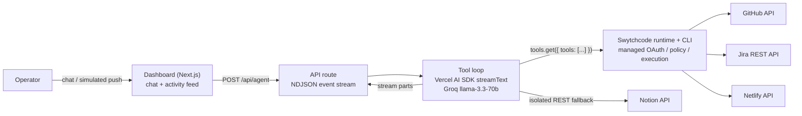

# Release Copilot

An AI-powered DevOps agent that automates the software release lifecycle: change analysis, risk triage, issue tracking, deployment, and release documentation — orchestrated through a single conversational interface with all third-party API execution delegated to [Swytchcode](https://www.swytchcode.com).

Built for the Build with Swytchcode Buildathon 2026 (Track 3: AI DevOps & Deployment Agent).

## Table of Contents

- [Overview](#overview)
- [Features](#features)
- [Architecture](#architecture)
- [Tech Stack](#tech-stack)
- [Project Structure](#project-structure)
- [Getting Started](#getting-started)
- [Usage](#usage)
- [API Reference](#api-reference)
- [Swytchcode Integration](#swytchcode-integration)
- [Error Handling](#error-handling)
- [Known Issues and Limitations](#known-issues-and-limitations)
- [Acknowledgments](#acknowledgments)

## Overview

Release Copilot receives a GitHub push event (or a natural-language instruction) and executes the full release workflow autonomously:

1. Fetches recent commits and diffs from the target repository.
2. Performs risk analysis on the changeset — unresolved `TODO`/`FIXME` markers, modifications to authentication/configuration surfaces, oversized diffs.
3. Creates one Jira issue per material risk (capped at three per run).
4. Triggers a Netlify build and monitors deploy status.
5. Publishes a structured release report to Notion.
6. Returns a linked summary to the operator.

The web dashboard exposes two synchronized views driven by a single event stream: a chat panel for operator interaction and a live activity feed rendering every tool invocation with its arguments, status, and a deep link to the created artifact.

## Features

- **Autonomous multi-step tool orchestration** — a single LLM tool-loop (capped at 12 steps) plans and executes the release pipeline without hardcoded sequencing.
- **Deterministic event injection** — a simulated push event exercises the identical code path as conversational triggers, making demos and testing reproducible.
- **Real-time observability** — every tool call streams to the UI as structured NDJSON events (call → running → ok/failed) with artifact deep links.
- **Managed authentication** — provider credentials are held by Swytchcode (OAuth), not by application code; no Authorization headers are constructed in the app for Swytchcode-served calls.
- **Model resilience** — automatic retry with exponential backoff and fallback model switching on rate limits.

## Architecture



**Request lifecycle.** The client posts the conversation to `/api/agent`. The route constructs the system prompt from environment-derived release context, resolves the Swytchcode tool set (cached per server process), and runs `streamText` against Groq. Each stream part (text delta, tool call, tool result) is mapped to a typed `AgentEvent` and written to the response as one NDJSON line. A single React hook (`useAgentStream`) consumes the stream and fans events out to the chat and activity feed components.

**Execution boundary.** Application code never constructs provider HTTP requests for Swytchcode-served methods. Tools returned by `tools.get()` carry their JSON schema and an `execute` callback that shells out to `swytchcode exec`, which enforces credentials, policy, and request construction from the locally installed method contracts.

## Tech Stack

| Layer | Technology |
| --- | --- |
| Framework | Next.js 16 (App Router), React 19, TypeScript |
| Agent runtime | Vercel AI SDK (`ai`), `@ai-sdk/groq` |
| Model | Groq `llama-3.3-70b-versatile` (fallback: `openai/gpt-oss-120b`) |
| API execution | Swytchcode CLI + `@swytchcode/runtime` (Vercel provider) |
| Styling | Tailwind CSS 4 |
| Streaming | NDJSON over HTTP chunked response |

## Project Structure

```text
.
├── scaffold/                      # Next.js application
│   └── src/
│       ├── app/
│       │   ├── api/agent/route.ts # Agent endpoint: tool loop + NDJSON streaming
│       │   ├── layout.tsx
│       │   └── page.tsx           # Dashboard: shared state, two-panel layout
│       ├── components/
│       │   ├── Chat.tsx           # Conversation panel
│       │   └── ActivityFeed.tsx   # Live tool-call feed with artifact links
│       └── lib/
│           ├── swytchcode.ts      # Swytchcode runtime tool resolution (cached)
│           ├── prompt.ts          # System prompt assembly from release context
│           ├── events.ts          # AgentEvent type + stream-part mapping
│           ├── useAgentStream.ts  # Client hook: NDJSON consumption + state
│           ├── simulatedPush.ts   # Canned push-event payload
│           └── notionFallback.ts  # Isolated Notion REST client (see Known Issues)
├── .env.example                   # Environment variable reference (names only)
└── README.md
```

## Getting Started

### Prerequisites

- Node.js ≥ 22
- A [Swytchcode](https://www.swytchcode.com) account with the CLI installed: `npm install -g swytchcode`
- Accounts on GitHub, Jira (Atlassian Cloud), Netlify, and Notion
- A [Groq](https://console.groq.com) API key

### Installation

```bash
git clone https://github.com/Aisenh037/Release-Copilot---AI-DevOps-Deployment-Agent.git
cd Release-Copilot---AI-DevOps-Deployment-Agent

# Swytchcode setup (from repository root)
swytchcode login
swytchcode auth connect GitHub
swytchcode auth connect Atlassian
swytchcode auth connect Netlify
swytchcode auth connect Notion

# Application dependencies
cd scaffold && npm install
```

### Configuration

Copy `.env.example` to `scaffold/.env` and populate:

| Variable | Description |
| --- | --- |
| `GROQ_API_KEY` | Groq API key |
| `GROQ_MODEL` | Primary model ID (default `llama-3.3-70b-versatile`) |
| `GROQ_FALLBACK_MODEL` | Fallback model on rate limit (default `openai/gpt-oss-120b`) |
| `RELEASE_REPO` | Target repository, `owner/name` |
| `RELEASE_BRANCH` | Release branch (e.g. `main`) |
| `JIRA_PROJECT_KEY` | Jira project key for risk issues |
| `NETLIFY_SITE_ID` | Netlify site UUID for deploy triggers |
| `NOTION_API_KEY` | Notion integration token (used by the REST fallback) |
| `NOTION_PARENT_PAGE_ID` | Notion page receiving release reports |
| `NEXT_PUBLIC_JIRA_SITE` | Jira site URL, used for issue deep links in the UI |
| `GITHUB_API_KEY` / `JIRA_API_KEY` / `JIRA_EMAIL` / `JIRA_SITE` / `NETLIFY_API_KEY` | Optional per-provider fallbacks for environments without Swytchcode OAuth connections |

### Running

```bash
# from the repository root (the CLI resolves .swytchcode/ from the working directory)
npm --prefix scaffold run dev
```

Open `http://localhost:3000`.

## Usage

**Autonomous flow** — click **Simulate push event**. The agent runs the full pipeline; the activity feed shows each call as it executes, and the final chat message links the created Jira issues, the Netlify deploy, and the Notion report.

**Conversational** — examples:

```text
prepare a release
what shipped today?
what's still open in Jira?
file a bug for the login flicker
```

Read-only questions use read-only tools; the agent only creates issues or triggers deploys when explicitly instructed or when handling a push event.

## API Reference

### `POST /api/agent`

Request body:

```json
{ "messages": [{ "role": "user", "content": "prepare a release" }] }
```

Response: `application/x-ndjson`, one `AgentEvent` per line:

| Event | Shape | Semantics |
| --- | --- | --- |
| `text` | `{ type, delta }` | Assistant text fragment |
| `tool-call` | `{ type, id, tool, args }` | Tool invocation started |
| `tool-result` | `{ type, id, tool, ok, result }` | Tool completed; `ok=false` on provider error |
| `error` | `{ type, message }` | Loop-level failure (after fallback exhaustion) |
| `done` | `{ type }` | Stream terminal marker |

## Swytchcode Integration

All methods were discovered and enabled through Swytchcode's contract-first flow (`search → get → add method → info`); input/output contracts from `swytchcode info` are the sole source of truth for tool arguments.

| Capability | Canonical ID | Verification |
| --- | --- | --- |
| List commits | `github.commit.get.1` | Live call (real data) |
| List pull requests | `github.pull.get` | Contract inspection |
| Compare / diff | `github.compare.get` | Contract inspection |
| Create issue | `atlassian.rest.issue.create` | Dry-run HTTP preview |
| Search issues (JQL) | `atlassian.rest.jql.create` | Live call (HTTP 200) |
| Trigger build | `netlify.build.create` | Dry-run HTTP preview |
| Deploy status | `netlify.deploy.get.1` | Contract inspection |

Provider authentication uses Swytchcode managed OAuth (`swytchcode auth connect`); the application holds no provider tokens for these calls.

## Error Handling

- Tool failures surface as `tool-result` events with `ok=false`; the agent reports the failure conversationally and continues the remaining pipeline steps where safe.
- Rate-limited model calls retry with exponential backoff, then switch to `GROQ_FALLBACK_MODEL`.
- Route-level failures emit a terminal `error` event; the client renders it in-conversation rather than failing silently.
- `swytchcode exec` errors are structured JSON on stderr with a `category` field (`auth`, `validation`, `rate_limit`, …) and a `retryable` flag, which the runtime propagates to tool results.

## Known Issues and Limitations

- **Notion write methods cannot currently be enabled via Swytchcode.** Every write method in the Notion bundle fails contract resolution (`resolve STRUCTs in RETURNS: struct "api.page.createResponse200" not found in STRUCTS`) — reproduced across bundle re-fetches and method variants, reported to the Swytchcode team as **SWY-ERR-014934**. Until the registry bundle is fixed, the Notion release-report step uses an isolated direct REST client ([`scaffold/src/lib/notionFallback.ts`](scaffold/src/lib/notionFallback.ts)) — the only non-Swytchcode call in the system, and removable without touching the agent loop once the bundle is repaired.
- Session state is in-memory and per-process; no persistence layer.
- Single-operator design; no authentication on the dashboard.
- The simulated push event is injected client-side; GitHub webhook ingestion is a natural extension but out of scope for the event build.

## Acknowledgments

Built solo in an 8-hour window at **Build with Swytchcode** (KNOTiC · Paytm Office, Noida · 9 August 2026), with development assistance from Claude Code.
