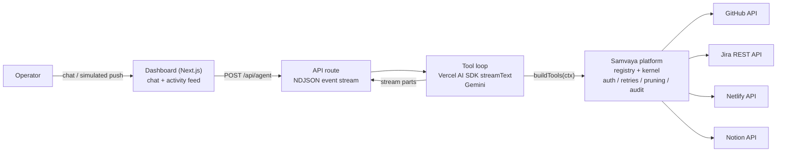

# Samvaya

**Samvaya** (समवाय — Sanskrit: *the inherent, inseparable connection*) is an in-house
integration platform: a declarative connector registry, an execution kernel, and a
tool emitter that lets an AI agent act on real third-party services. No external
integration SaaS, no vendor runtime — the platform owns request construction, auth,
retries, response pruning, and audit end to end.

Its flagship product is **Release Copilot, by Samvaya** — an AI DevOps agent that
automates the software release lifecycle: change analysis, risk triage, issue
tracking, deployment, and release documentation, orchestrated through a single
conversational interface.

> Connect once, act everywhere.

## Table of Contents

- [Overview](#overview)
- [Architecture](#architecture)
- [The Samvaya Platform](#the-samvaya-platform)
- [Tech Stack](#tech-stack)
- [Project Structure](#project-structure)
- [Getting Started](#getting-started)
- [Usage](#usage)
- [API Reference](#api-reference)
- [Error Handling](#error-handling)
- [Roadmap](#roadmap)
- [Known Issues and Limitations](#known-issues-and-limitations)
- [Acknowledgments](#acknowledgments)

## Overview

Release Copilot receives a GitHub push event (or a natural-language instruction) and
executes the full release workflow autonomously:

1. Fetches recent commits and diffs from the target repository.
2. Performs risk analysis on the changeset — unresolved `TODO`/`FIXME` markers,
   modifications to authentication/configuration surfaces, oversized diffs.
3. Creates one Jira issue per material risk (capped at three per run).
4. Triggers a Netlify build and monitors deploy status.
5. Publishes a structured release report to Notion.
6. Returns a linked summary to the operator.

The web dashboard exposes two synchronized views driven by a single event stream: a
chat panel for operator interaction and a live activity feed rendering every tool
invocation with its arguments, status, and a deep link to the created artifact.

## Architecture



**Request lifecycle.** The client posts the conversation to `/api/agent`. The route
constructs the system prompt (release context from env + tool guidance generated
from the connector registry), resolves the platform tool set (cached per server
process), and runs `streamText` against Gemini. Each stream part (text delta, tool
call, tool result) is mapped to a typed `AgentEvent` and written to the response as
one NDJSON line. A single React hook (`useAgentStream`) consumes the stream and fans
events out to the chat and activity feed components.

**Execution boundary.** Application code never constructs provider HTTP requests.
Tools emitted from the registry carry their JSON schema and an `execute` callback
that delegates to the kernel's `executeOperation()`, which builds the request from
the declarative operation definition, injects auth, enforces retry policy, prunes
oversized responses to protect model context, and emits audit events.

## The Samvaya Platform

Everything lives in [`scaffold/src/lib/platform/`](scaffold/src/lib/platform/):

| Piece | File | Role |
| --- | --- | --- |
| Connector definitions | `connectors/{github,atlassian,netlify,notion}.ts` | Declarative providers + operations: HTTP shape, input JSON Schema, auth style, artifact-link selectors |
| Registry | `registry.ts` | Aggregation, id maps, tool-name (de)mangling, fail-fast validation |
| Kernel | `kernel.ts` | `executeOperation(id, args, ctx)` — never throws; `{ok, status, url, data}` / `{ok:false, error}` result union |
| Auth seam | `auth.ts` | Env-var resolver today; `setAuthResolver()` is the plug-in point for the per-workspace OAuth token vault (roadmap Phase C) |
| Tool emitter | `tools.ts` | Registry → Vercel AI SDK tool set |
| Prompt block | `prompt-block.ts` | Intent→tool guidance generated from the registry — can never drift |
| Artifacts | `artifacts.ts` | Client-safe deep-link resolution (GitHub commit URLs, Jira browse links, Netlify deploy URLs, Notion pages) |
| Audit | `audit.ts` | JSONL audit trail (console + optional `AUDIT_LOG_FILE`); never logs payloads or secrets |

Current connector catalog: **GitHub** (list commits, list PRs, compare), **Jira**
(create issue, JQL search), **Netlify** (trigger build, deploy status), **Notion**
(append release report).

Debugging: set `PLATFORM_DRY_RUN=1` to preview the exact HTTP request (method, URL,
redacted headers, body) for every tool call without touching the network.

## Tech Stack

| Layer | Technology |
| --- | --- |
| Framework | Next.js 16 (App Router), React 19, TypeScript |
| Agent runtime | Vercel AI SDK (`ai`), `@ai-sdk/google` |
| Model | Gemini (`GEMINI_MODEL`, fallback `GEMINI_FALLBACK_MODEL`) |
| API execution | Samvaya platform (in-house registry + kernel) |
| Styling | Tailwind CSS 4 |
| Streaming | NDJSON over HTTP chunked response |
| Tests | node:test via tsx (`npm test`) |

## Project Structure

```text
.
├── scaffold/                      # Next.js application
│   ├── demo.mts                   # Headless terminal runner (same agent loop, no Next.js)
│   └── src/
│       ├── app/
│       │   ├── api/agent/route.ts # Agent endpoint: tool loop + NDJSON streaming
│       │   ├── layout.tsx
│       │   └── page.tsx           # Dashboard: shared state, two-panel layout
│       ├── components/
│       │   ├── Chat.tsx           # Conversation panel
│       │   └── ActivityFeed.tsx   # Live tool-call feed with artifact links
│       └── lib/
│           ├── platform/          # ★ The Samvaya platform (see table above)
│           ├── events.ts          # AgentEvent type + stream-part mapping
│           ├── prompt.ts          # System prompt assembly
│           ├── useAgentStream.ts  # Client hook: NDJSON consumption + state
│           └── simulatedPush.ts   # Canned push-event payload
├── docs/engineering/              # Provider contract notes
└── README.md
```

## Getting Started

### Prerequisites

- Node.js ≥ 22
- Accounts on GitHub, Jira (Atlassian Cloud), Netlify, and Notion
- A Gemini API key ([Google AI Studio](https://aistudio.google.com))

### Installation

```bash
git clone https://github.com/Aisenh037/Release-Copilot---AI-DevOps-Deployment-Agent.git
cd Release-Copilot---AI-DevOps-Deployment-Agent/scaffold
npm install
```

### Configuration

Copy `scaffold/.env.example` to `scaffold/.env` and populate:

| Variable | Description |
| --- | --- |
| `GEMINI_API_KEY` | Gemini API key |
| `GEMINI_MODEL` / `GEMINI_FALLBACK_MODEL` | Model ids (defaults in code) |
| `GITHUB_API_KEY` | GitHub token (repo read) |
| `JIRA_SITE` / `JIRA_EMAIL` / `JIRA_API_KEY` | Atlassian Cloud site URL + API token (Basic auth) |
| `NETLIFY_API_KEY` | Netlify personal access token |
| `NOTION_API_KEY` / `NOTION_PARENT_PAGE_ID` | Notion integration token + report page |
| `RELEASE_REPO` / `RELEASE_BRANCH` / `JIRA_PROJECT_KEY` / `NETLIFY_SITE_ID` | Release context |
| `NEXT_PUBLIC_JIRA_SITE` | Jira site URL, used for issue deep links in the UI |
| `PLATFORM_DRY_RUN` | `1` = preview requests without executing (optional) |
| `AUDIT_LOG_FILE` | Path for JSONL audit log (optional) |

### Running

```bash
npm run dev     # dashboard on http://localhost:3000
npm test        # platform unit tests (dry-run request construction)
npm run demo    # headless agent loop in the terminal
```

## Usage

**Autonomous flow** — click **Simulate push event**. The agent runs the full
pipeline; the activity feed shows each call as it executes, and the final chat
message links the created Jira issues, the Netlify deploy, and the Notion report.

**Conversational** — examples:

```text
prepare a release
what shipped today?
what's still open in Jira?
file a bug for the login flicker
```

Read-only questions use read-only tools; the agent only creates issues or triggers
deploys when explicitly instructed or when handling a push event.

## API Reference

### `POST /api/agent`

Request body:

```json
{ "messages": [{ "role": "user", "content": "prepare a release" }] }
```

Response: `application/x-ndjson`, one `AgentEvent` per line:

| Event | Shape | Semantics |
| --- | --- | --- |
| `text` | `{ type, delta }` | Assistant text fragment |
| `tool-call` | `{ type, id, tool, args }` | Tool invocation started (`tool` is the canonical operation id) |
| `tool-result` | `{ type, id, tool, ok, result }` | Tool completed; `result` is the kernel envelope |
| `error` | `{ type, message }` | Loop-level failure (after fallback exhaustion) |
| `done` | `{ type }` | Stream terminal marker |

## Error Handling

- The kernel never throws: every failure is a `{ ok: false, error, status?, url? }`
  result the model can read, report, and route around. Config guards (missing env
  vars) fail before any network call, with the variable named in the error.
- Retry policy per provider: 3 retries with exponential backoff + jitter on
  429/503/504 and network errors, honoring `Retry-After`; all other statuses are
  terminal.
- Rate-limited model calls retry with backoff, then switch to
  `GEMINI_FALLBACK_MODEL`.
- Route-level failures emit a terminal `error` event; the client renders it
  in-conversation rather than failing silently.

## Roadmap

Samvaya is being built out from this foundation in phases:

- **Phase B — accounts & persistence:** own auth (argon2id + GitHub/Google OAuth
  sign-in, hand-rolled), Postgres + Drizzle, personal/team workspaces.
- **Phase C — Connection Hub:** per-workspace OAuth connections through our own
  OAuth apps, AES-256-GCM token vault, `resolveAuth` plugged into the kernel's
  existing auth seam.
- **Phase D — product surface:** landing, onboarding wizard, template gallery
  (Release Copilot is template #1), catalog expansion (GitLab, Slack, AWS, …).
- **Phase E — revenue & platform:** freemium tiers (Razorpay + Stripe), public
  `/v1/execute` API where the kernel seam becomes the product.

## Known Issues and Limitations

- Session state is in-memory and per-process; no persistence layer (Phase B).
- Single-operator design; no authentication on the dashboard (Phase B).
- The simulated push event is injected client-side; GitHub webhook ingestion is a
  natural extension.
- Gemini free-tier daily quotas are small; the demo runner and dashboard share them.

## Acknowledgments

Release Copilot began as a solo 8-hour build at **Build with Swytchcode** (KNOTiC ·
Paytm Office, Noida · 9 August 2026), originally executing API calls through the
Swytchcode runtime. It has since been rebuilt on Samvaya, an in-house platform, with
development assistance from Claude Code. The Swytchcode-era method contract notes
are preserved in [`docs/engineering/`](docs/engineering/).
