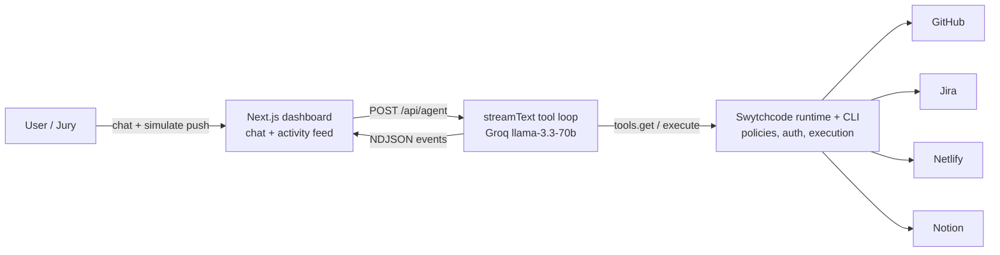

# Release Copilot Implementation Plan

> **For agentic workers:** REQUIRED SUB-SKILL: Use superpowers:subagent-driven-development (recommended) or superpowers:executing-plans to implement this plan task-by-task. Steps use checkbox (`- [ ]`) syntax for tracking.

**Goal:** An AI DevOps agent (chat dashboard + live tool-call feed) that analyzes GitHub changes, files Jira issues, triggers a Netlify deploy, and writes a Notion release report — every external call via Swytchcode.

**Architecture:** Single Next.js App Router app. A POST `/api/agent` route runs a Vercel AI SDK `streamText` tool loop (Groq model) whose tools come from `@swytchcode/runtime` `tools.get()`; the route streams NDJSON events that one React hook fans out into a chat panel and an activity feed.

**Tech Stack:** Next.js 15 (App Router, TypeScript, Tailwind), Vercel AI SDK (`ai@^5`, `@ai-sdk/groq`), `@swytchcode/runtime` with the Vercel provider adapter, Swytchcode CLI.

## Global Constraints

- **Spec:** `docs/superpowers/specs/2026-08-09-release-copilot-design.md`. Deadline: **3:30 PM today** (Commudle submission).
- **All external API calls go through Swytchcode** per the Agent Contract in `CLAUDE.md` — Golden Path (`search → get → add method → info`) before any codegen; never invent canonical IDs; never hand-write execution logic; never read/reason about `.swytchcode/` internals.
- Models: primary `llama-3.3-70b-versatile`, fallback `openai/gpt-oss-120b`, via env `GROQ_MODEL` / `GROQ_FALLBACK_MODEL`. Tool-loop cap: 12 steps.
- No database, no auth, no webhooks, no multi-agent. In-memory state only.
- Secrets only in `.env.local` (gitignored). Never commit tokens. `.env.example` documents names only.
- Git commits: plain messages, **no Co-Authored-By trailers**. Commit after every task at minimum.
- Testing policy (per spec): smoke verification of the hero flow at each task boundary instead of unit-test cycles — the 4.5h window and external-API surface make curl/browser smoke checks the verification unit. Where a step says "Expected:", actually run it and confirm before moving on.
- Demo constants via env: `RELEASE_REPO=Aisenh037/Release-Copilot---AI-DevOps-Deployment-Agent`, `RELEASE_BRANCH=main`, `JIRA_PROJECT_KEY=REL`, `NETLIFY_SITE_ID=<from Task 0>`, `NOTION_PARENT_PAGE_ID=<from Task 0>`.

---

### Task 0: Accounts & credentials (manual, during registration downtime)

**Files:**
- Create: `.env.local` (never committed)

**Interfaces:**
- Produces: working credentials for Jira, Netlify, Notion, GitHub, Groq + the env constants above. Every later task assumes these exist.

- [ ] **Step 1: Jira** — create free site at https://www.atlassian.com/software/jira/free → create project, type "Kanban", name "Releases", key `REL`. Create API token at https://id.atlassian.com/manage-profile/security/api-tokens. Record: site URL (`https://<you>.atlassian.net`), account email, token.
- [ ] **Step 2: Netlify** — sign up at https://app.netlify.com. Create the demo site: new GitHub repo `release-copilot-status` containing one `index.html` (`<h1>Release Copilot — deployed by an AI agent</h1><p>Deploy: OK</p>`); "Add new site → Import from Git" → pick it (no build command, publish dir `/`). Record the **site ID** (Site settings → Site details → Site ID) and create a Personal Access Token (User settings → Applications → New access token).
- [ ] **Step 3: Notion** — free workspace at https://notion.so. Create integration at https://www.notion.so/my-integrations (internal, read+insert content); create a page "Release Reports", share it with the integration (page ⋯ → Connections → your integration). Record: integration token, parent page ID (32-hex from the page URL).
- [ ] **Step 4: GitHub** — fine-grained PAT at https://github.com/settings/personal-access-tokens for repo `Release-Copilot---AI-DevOps-Deployment-Agent`: Contents read, Pull requests read. Record token.
- [ ] **Step 5: Groq** — confirm key works: `curl -s https://api.groq.com/openai/v1/models -H "Authorization: Bearer $GROQ_API_KEY" | head -c 300` → JSON model list.
- [ ] **Step 6:** Put all values in `.env.local` at repo root (exact auth var names get finalized in Task 2 Step 4 from `swytchcode info`; start with `GROQ_API_KEY`, `GROQ_MODEL=llama-3.3-70b-versatile`, `GROQ_FALLBACK_MODEL=openai/gpt-oss-120b`, `GITHUB_API_KEY`, `JIRA_API_KEY`, `JIRA_EMAIL`, `JIRA_SITE`, `NETLIFY_API_KEY`, `NOTION_API_KEY`, plus the five demo constants from Global Constraints and `NEXT_PUBLIC_JIRA_SITE=<same value as JIRA_SITE>` for UI deep links).

---

### Task 1: Scaffold Next.js app at repo root

**Files:**
- Create: standard `create-next-app` output at repo root (`package.json`, `src/app/…`, `next.config.ts`, `tsconfig.json`, `.gitignore`, …)

**Interfaces:**
- Produces: `npm run dev` serves the default page on `http://localhost:3000`; `src/` layout with `@/*` path alias; Tailwind active.

- [ ] **Step 1: Scaffold in a temp dir, copy into root** (create-next-app refuses non-empty dirs):

```bash
cd /d/SwytchCode
npx create-next-app@latest release-copilot --typescript --tailwind --eslint --app --src-dir --use-npm --yes
cp -r release-copilot/. .
rm -rf release-copilot README.md   # README rewritten in Task 6; temp dir name sets package.json name "release-copilot"
```

- [ ] **Step 2: Verify `.env*` is gitignored**: `grep -n "env" .gitignore` → expect `.env*` line. If missing, add `.env*.local` and `.env.local`.
- [ ] **Step 3: Smoke run**: `npm run dev` → open http://localhost:3000 → default Next.js page renders. Stop the server.
- [ ] **Step 4: Commit**:

```bash
git add -A && git commit -m "Scaffold Next.js app (TS, Tailwind, App Router)" && git push
```

---

### Task 2: Swytchcode Golden Path spike — enable + verify all four integrations

**Files:**
- Modify: `.swytchcode/tooling.json` (via CLI only — never by hand)
- Create: `docs/superpowers/plans/swytchcode-methods.md` (canonical-ID record)
- Create: `.env.example`

**Interfaces:**
- Produces: ~8 enabled methods across github/jira/netlify/notion; `docs/superpowers/plans/swytchcode-methods.md` mapping spec tool name → canonical ID → required inputs → auth env var; installed `@swytchcode/runtime`; the exact Vercel-provider import line (from the runtime README); one **verified live call** (GitHub commits) + `--dry-run` verification for Jira/Netlify/Notion.

- [ ] **Step 1: Auth check**: `npx swytchcode whoami` → logged in. If not: `npx swytchcode login` (user completes browser flow).
- [ ] **Step 2: Discover integrations**: `npx swytchcode search github`, then same for `jira`, `netlify`, `notion`. Note exact integration/library names. If any service is missing from the catalog, STOP and ask the user (contract rule) — fallback is direct REST for that one service, clearly labeled in README as outside Swytchcode, but only with user sign-off.
- [ ] **Step 3: Fetch + enable methods**: for each integration, `npx swytchcode get <integration>`, then `npx swytchcode add method <canonical_id>` for the 8 spec tools: GitHub list commits / list PRs / get diff-or-compare; Jira create issue / search issues; Netlify trigger build / get deploy status; Notion create page. Choose the closest real canonical IDs from the `get` output — do not guess. Confirm with `npx swytchcode list tooling` (all 8 listed).
- [ ] **Step 4: Record contracts**: for each enabled ID, `npx swytchcode info <canonical_id>`. Write `docs/superpowers/plans/swytchcode-methods.md` as a table: spec tool name | canonical_id | required inputs | auth header env var. Rename `.env.local` keys to match the exact env var names `info` shows; mirror names (no values) into `.env.example`.
- [ ] **Step 5: Install runtime + AI SDK deps**:

```bash
npm install @swytchcode/runtime ai @ai-sdk/groq
```

- [ ] **Step 6: Get the exact agentic API**: open `node_modules/@swytchcode/runtime/README.md`, "Agentic workflows" section. Record verbatim: the Vercel provider import path + export name, the exact `tools.get()` call shape for the Vercel AI SDK, and whether its return value is an array or a name→tool map. Append these three lines to `swytchcode-methods.md`. (Contract forbids inventing these; Task 3 code uses exactly what's recorded here.)
- [ ] **Step 7: Verify one live call per service** (cheap reads live, writes dry-run):

```bash
npx swytchcode exec <github_list_commits_id> '{"owner":"Aisenh037","repo":"Release-Copilot---AI-DevOps-Deployment-Agent"}'   # expect real commit JSON
npx swytchcode exec <jira_create_issue_id> '{...minimal required inputs...}' --dry-run     # expect correct URL/headers preview
npx swytchcode exec <netlify_trigger_build_id> '{"site_id":"<id>"}' --dry-run
npx swytchcode exec <notion_create_page_id> '{...}' --dry-run
```

Fix auth env names until the GitHub live call returns real data.
- [ ] **Step 8: Commit**:

```bash
git add .swytchcode docs/superpowers/plans/swytchcode-methods.md .env.example package.json package-lock.json
git commit -m "Enable Swytchcode methods for github/jira/netlify/notion via Golden Path" && git push
```

---

### Task 3: Agent core — tools, prompt, streaming route

**Files:**
- Create: `src/lib/swytchcode.ts`, `src/lib/prompt.ts`, `src/lib/events.ts`, `src/app/api/agent/route.ts`

**Interfaces:**
- Consumes: enabled tooling + exact runtime API recorded in `swytchcode-methods.md` (Task 2).
- Produces: `POST /api/agent` `{ messages: {role,content}[] }` → NDJSON stream of `AgentEvent` lines. `AgentEvent = { type: "text", delta: string } | { type: "tool-call", id: string, tool: string, args: unknown } | { type: "tool-result", id: string, tool: string, ok: boolean, result: unknown } | { type: "error", message: string } | { type: "done" }`. Task 4 consumes exactly this.

- [ ] **Step 1: `src/lib/swytchcode.ts`** — tool loading, cached per server process. Use the import/export names recorded in Task 2 Step 6 (shown here as expected from the contract; correct them if the README differs):

```ts
import { Swytchcode, TOOL_USE_INSTRUCTIONS } from "@swytchcode/runtime";
import { VercelProvider } from "@swytchcode/runtime/providers/vercel";

let toolsPromise: ReturnType<typeof load> | null = null;

async function load() {
  const swx = new Swytchcode(new VercelProvider());
  return swx.tools.get({ toolkits: ["github", "jira", "netlify", "notion"] });
}

export function getTools() {
  toolsPromise ??= load();
  return toolsPromise;
}

export { TOOL_USE_INSTRUCTIONS };
```

(`toolkits` values = toolkit names from Task 2 Step 2, lowercase as listed by `swytchcode list`.)
- [ ] **Step 2: `src/lib/prompt.ts`**:

```ts
import { TOOL_USE_INSTRUCTIONS } from "./swytchcode";

export function systemPrompt(): string {
  return `You are Release Copilot, a careful DevOps engineer managing releases for
${process.env.RELEASE_REPO} (branch ${process.env.RELEASE_BRANCH}).

Context you must use in tool arguments:
- Jira project key: ${process.env.JIRA_PROJECT_KEY}
- Netlify site id: ${process.env.NETLIFY_SITE_ID}
- Notion parent page id: ${process.env.NOTION_PARENT_PAGE_ID}

When you receive a push event or are asked to prepare a release, do ALL of these in order:
1. Fetch recent commits and the diff for the latest changes.
2. Summarize what changed. Flag risks: TODO/FIXME markers, changes to auth/payment/config files, unusually large diffs.
3. Create one Jira issue per material risk (max 3). Summary prefixed "[release-risk]".
4. Trigger a Netlify deploy for the site id above, then check its status once or twice; if still building, report the deploy URL and say it is in progress.
5. Create a Notion page under the parent page id above titled "Release Report <today's date>" containing: summary of changes, risks found, Jira issue keys, deploy status/URL.
6. Reply in chat with a short summary linking everything you created.

For conversational questions, use read-only tools; never deploy or create issues unless asked or handling a push event.
If a tool fails, say what failed and continue with the remaining steps when sensible. Never invent results.

${TOOL_USE_INSTRUCTIONS}`;
}
```

- [ ] **Step 3: `src/lib/events.ts`** — map AI SDK fullStream parts to `AgentEvent`:

```ts
export type AgentEvent =
  | { type: "text"; delta: string }
  | { type: "tool-call"; id: string; tool: string; args: unknown }
  | { type: "tool-result"; id: string; tool: string; ok: boolean; result: unknown }
  | { type: "error"; message: string }
  | { type: "done" };

export function partToEvent(part: Record<string, unknown> & { type: string }): AgentEvent | null {
  switch (part.type) {
    case "text-delta":
      return { type: "text", delta: String(part.text ?? part.textDelta ?? "") };
    case "tool-call":
      return { type: "tool-call", id: String(part.toolCallId), tool: String(part.toolName), args: part.input ?? part.args };
    case "tool-result": {
      const result = part.output ?? part.result;
      const ok = !(result && typeof result === "object" && "error" in (result as object));
      return { type: "tool-result", id: String(part.toolCallId), tool: String(part.toolName), ok, result };
    }
    case "error":
      return { type: "error", message: String(part.error) };
    case "finish":
      return { type: "done" };
    default:
      return null;
  }
}
```

- [ ] **Step 4: `src/app/api/agent/route.ts`** — streamText with fallback-model retry:

```ts
import { streamText, stepCountIs } from "ai";
import { createGroq } from "@ai-sdk/groq";
import { getTools } from "@/lib/swytchcode";
import { systemPrompt } from "@/lib/prompt";
import { partToEvent } from "@/lib/events";

export const maxDuration = 300;

export async function POST(req: Request) {
  const { messages } = await req.json();
  const groq = createGroq({ apiKey: process.env.GROQ_API_KEY });
  const tools = await getTools();
  const encoder = new TextEncoder();

  const run = (modelId: string) =>
    streamText({
      model: groq(modelId),
      system: systemPrompt(),
      messages,
      tools,               // if Task 2 Step 6 recorded an array, convert: Object.fromEntries(tools.map(t => [t.name, t]))
      stopWhen: stepCountIs(12),
    });

  const stream = new ReadableStream({
    async start(controller) {
      const send = (e: object) => controller.enqueue(encoder.encode(JSON.stringify(e) + "\n"));
      const models = [process.env.GROQ_MODEL ?? "llama-3.3-70b-versatile", process.env.GROQ_FALLBACK_MODEL ?? "openai/gpt-oss-120b"];
      for (let i = 0; i < models.length; i++) {
        try {
          let emitted = false;
          for await (const part of run(models[i]).fullStream) {
            const evt = partToEvent(part as never);
            if (evt?.type === "error" && !emitted && i < models.length - 1) throw new Error(evt.message);
            if (evt) { send(evt); if (evt.type !== "error") emitted = true; }
          }
          break; // finished cleanly
        } catch (err) {
          if (i === models.length - 1) send({ type: "error", message: String(err) });
          else send({ type: "text", delta: `\n(Retrying with fallback model…)\n` });
        }
      }
      send({ type: "done" });
      controller.close();
    },
  });

  return new Response(stream, { headers: { "Content-Type": "application/x-ndjson" } });
}
```

- [ ] **Step 5: Smoke test the route** (dev server running):

```bash
curl -N -s http://localhost:3000/api/agent -H "Content-Type: application/json" \
  -d '{"messages":[{"role":"user","content":"List the most recent commits on our release repo and summarize them."}]}'
```

Expected: NDJSON lines — at least one `tool-call` for the GitHub commits tool, a `tool-result` with real commit data, `text` deltas summarizing, final `{"type":"done"}`. Debug tool failures with `npx swytchcode exec <id> '...' --verbose 2>debug.log`.
- [ ] **Step 6: Commit**:

```bash
git add src && git commit -m "Agent core: Swytchcode tools + Groq streamText + NDJSON route" && git push
```

---

### Task 4: Dashboard UI — chat, activity feed, simulate button

**Files:**
- Create: `src/lib/useAgentStream.ts`, `src/components/Chat.tsx`, `src/components/ActivityFeed.tsx`, `src/lib/simulatedPush.ts`
- Modify: `src/app/page.tsx`, `src/app/layout.tsx` (title only)

**Interfaces:**
- Consumes: `POST /api/agent` NDJSON `AgentEvent` protocol from Task 3 (exact union type above).
- Produces: the complete demo UI.

- [ ] **Step 1: `src/lib/simulatedPush.ts`**:

```ts
export const SIMULATED_PUSH = [
  "[GitHub push event received]",
  "repository: Aisenh037/Release-Copilot---AI-DevOps-Deployment-Agent",
  "ref: refs/heads/main",
  "Handle this push per your release policy: analyze the changes, file risk issues, deploy, and publish the release report.",
].join("\n");
```

- [ ] **Step 2: `src/lib/useAgentStream.ts`** — one hook owning all state:

```ts
"use client";
import { useCallback, useRef, useState } from "react";
import type { AgentEvent } from "./events";

export type ChatMsg = { role: "user" | "assistant"; content: string };
export type FeedItem = { id: string; tool: string; args: unknown; status: "running" | "ok" | "failed"; result?: unknown };

export function useAgentStream() {
  const [messages, setMessages] = useState<ChatMsg[]>([]);
  const [feed, setFeed] = useState<FeedItem[]>([]);
  const [busy, setBusy] = useState(false);
  const history = useRef<ChatMsg[]>([]);

  const send = useCallback(async (content: string) => {
    if (busy) return;
    setBusy(true);
    history.current = [...history.current, { role: "user", content }];
    setMessages([...history.current, { role: "assistant", content: "" }]);
    let assistant = "";
    try {
      const res = await fetch("/api/agent", {
        method: "POST",
        headers: { "Content-Type": "application/json" },
        body: JSON.stringify({ messages: history.current }),
      });
      const reader = res.body!.getReader();
      const decoder = new TextDecoder();
      let buf = "";
      for (;;) {
        const { done, value } = await reader.read();
        if (done) break;
        buf += decoder.decode(value, { stream: true });
        const lines = buf.split("\n");
        buf = lines.pop() ?? "";
        for (const line of lines) {
          if (!line.trim()) continue;
          const evt = JSON.parse(line) as AgentEvent;
          if (evt.type === "text") {
            assistant += evt.delta;
            setMessages([...history.current, { role: "assistant", content: assistant }]);
          } else if (evt.type === "tool-call") {
            setFeed((f) => [...f, { id: evt.id, tool: evt.tool, args: evt.args, status: "running" }]);
          } else if (evt.type === "tool-result") {
            setFeed((f) => f.map((it) => (it.id === evt.id ? { ...it, status: evt.ok ? "ok" : "failed", result: evt.result } : it)));
          } else if (evt.type === "error") {
            assistant += `\n⚠️ ${evt.message}`;
            setMessages([...history.current, { role: "assistant", content: assistant }]);
          }
        }
      }
    } finally {
      history.current = [...history.current, { role: "assistant", content: assistant }];
      setBusy(false);
    }
  }, [busy]);

  return { messages, feed, busy, send };
}
```

- [ ] **Step 3: `src/components/Chat.tsx`**:

```tsx
"use client";
import { useEffect, useRef, useState } from "react";
import type { ChatMsg } from "@/lib/useAgentStream";

export function Chat({ messages, busy, send }: { messages: ChatMsg[]; busy: boolean; send: (t: string) => void }) {
  const [input, setInput] = useState("");
  const endRef = useRef<HTMLDivElement>(null);
  useEffect(() => endRef.current?.scrollIntoView({ behavior: "smooth" }), [messages]);

  return (
    <section className="flex flex-col rounded-xl border border-zinc-200 dark:border-zinc-800 overflow-hidden">
      <div className="flex-1 overflow-y-auto p-4 space-y-3">
        {messages.map((m, i) => (
          <div key={i} className={m.role === "user" ? "flex justify-end" : "flex justify-start"}>
            <div className={`max-w-[85%] whitespace-pre-wrap rounded-2xl px-4 py-2 text-sm ${
              m.role === "user" ? "bg-indigo-600 text-white" : "bg-zinc-100 dark:bg-zinc-800"}`}>
              {m.content || "…"}
            </div>
          </div>
        ))}
        <div ref={endRef} />
      </div>
      <form
        className="flex gap-2 border-t border-zinc-200 dark:border-zinc-800 p-3"
        onSubmit={(e) => { e.preventDefault(); if (input.trim()) { send(input.trim()); setInput(""); } }}
      >
        <input
          className="flex-1 rounded-lg border border-zinc-300 dark:border-zinc-700 bg-transparent px-3 py-2 text-sm outline-none"
          value={input} onChange={(e) => setInput(e.target.value)}
          placeholder='Try "prepare a release" or "what shipped today?"' disabled={busy}
        />
        <button className="rounded-lg bg-indigo-600 px-4 py-2 text-sm font-medium text-white disabled:opacity-50" disabled={busy}>
          Send
        </button>
      </form>
    </section>
  );
}
```

- [ ] **Step 4: `src/components/ActivityFeed.tsx`**:

```tsx
"use client";
import type { FeedItem } from "@/lib/useAgentStream";

function artifactLink(item: FeedItem): string | null {
  const r = item.result;
  if (!r || typeof r !== "object") return null;
  const o = r as Record<string, unknown>;
  for (const k of ["html_url", "deploy_ssl_url", "url"]) if (typeof o[k] === "string") return o[k] as string;
  if (typeof o.key === "string" && process.env.NEXT_PUBLIC_JIRA_SITE)
    return `${process.env.NEXT_PUBLIC_JIRA_SITE}/browse/${o.key}`;
  return null;
}

const DOT = { running: "bg-amber-400 animate-pulse", ok: "bg-emerald-500", failed: "bg-red-500" } as const;

export function ActivityFeed({ feed }: { feed: FeedItem[] }) {
  return (
    <section className="overflow-y-auto rounded-xl border border-zinc-200 dark:border-zinc-800 p-4 space-y-2">
      <h2 className="text-xs font-semibold uppercase tracking-wide text-zinc-500">Swytchcode activity</h2>
      {feed.length === 0 && <p className="text-sm text-zinc-500">Tool calls appear here as the agent works.</p>}
      {feed.map((item) => {
        const link = artifactLink(item);
        return (
          <div key={item.id} className={`rounded-lg border p-3 text-sm ${item.status === "failed" ? "border-red-400" : "border-zinc-200 dark:border-zinc-800"}`}>
            <div className="flex items-center gap-2">
              <span className={`h-2.5 w-2.5 rounded-full ${DOT[item.status]}`} />
              <span className="rounded bg-zinc-100 dark:bg-zinc-800 px-1.5 py-0.5 text-xs font-medium">
                {item.tool.split(/[._]/)[0]}
              </span>
              <span className="font-mono text-xs">{item.tool}</span>
              {link && <a href={link} target="_blank" className="ml-auto text-indigo-600 text-xs underline">Open ↗</a>}
            </div>
            <p className="mt-1 truncate font-mono text-xs text-zinc-500">{JSON.stringify(item.args)?.slice(0, 120)}</p>
          </div>
        );
      })}
    </section>
  );
}
```

- [ ] **Step 5: `src/app/page.tsx`** (hook lives here so both panels share state):

```tsx
"use client";
import { Chat } from "@/components/Chat";
import { ActivityFeed } from "@/components/ActivityFeed";
import { useAgentStream } from "@/lib/useAgentStream";
import { SIMULATED_PUSH } from "@/lib/simulatedPush";

export default function Home() {
  const { messages, feed, busy, send } = useAgentStream();
  return (
    <main className="mx-auto max-w-6xl p-4">
      <header className="mb-4 flex items-center justify-between">
        <div>
          <h1 className="text-xl font-bold">Release Copilot</h1>
          <p className="text-sm text-zinc-500">AI DevOps agent — every call runs through Swytchcode</p>
        </div>
        <button
          onClick={() => send(SIMULATED_PUSH)} disabled={busy}
          className="rounded-lg bg-emerald-600 px-4 py-2 text-sm font-medium text-white disabled:opacity-50"
        >
          ⚡ Simulate push event
        </button>
      </header>
      <div className="grid h-[calc(100vh-7rem)] grid-cols-2 gap-4">
        <Chat messages={messages} busy={busy} send={send} />
        <ActivityFeed feed={feed} />
      </div>
    </main>
  );
}
```

Also set the tab title in `src/app/layout.tsx`: `export const metadata = { title: "Release Copilot", description: "AI DevOps agent powered by Swytchcode" }`.
- [ ] **Step 6: Browser smoke test**: `npm run dev` → send "what shipped recently?" → chat streams an answer AND a GitHub card appears in the feed, running→ok. Click Simulate → cards appear for github → jira → netlify → notion in sequence.
- [ ] **Step 7: Commit**:

```bash
git add src && git commit -m "Dashboard: chat panel, live activity feed, simulate-push trigger" && git push
```

---

### Task 5: Seed risk data + full rehearsal

**Files:**
- Create: `src/lib/legacy/session-auth.ts` (intentional risk bait, real file)
- Modify: none

**Interfaces:**
- Produces: repo content that makes the agent's risk analysis find something genuine; two verified end-to-end rehearsal runs.

- [ ] **Step 1: Seed risky commits** (separate commits so the diff shows them):

```bash
mkdir -p src/lib/legacy
cat > src/lib/legacy/session-auth.ts <<'EOF'
// Legacy session validation kept during the auth migration.
// TODO: remove the fallback below before GA — it skips token expiry checks.
export function validateSessionLegacy(token: string): boolean {
  if (process.env.AUTH_MIGRATION_FALLBACK === "1") return token.length > 0;
  return false; // FIXME: real expiry validation not implemented yet
}
EOF
git add src/lib/legacy && git commit -m "Keep legacy session validation during auth migration" && git push
```

- [ ] **Step 2: Rehearsal run 1**: click **Simulate push event**. Verify against real services: Jira has 1–3 new `[release-risk]` issues in `REL`; Netlify shows a new deploy for the status site; Notion has a "Release Report 2026-08-09" page with summary/risks/issue keys/deploy link; chat summary links everything.
- [ ] **Step 3: Fix the top failure** (most likely: a tool arg the model gets wrong → tighten the relevant line of `systemPrompt()` with the exact field name from `swytchcode-methods.md`; or a rate limit → confirm the fallback-model message appears and the run completes).
- [ ] **Step 4: Rehearsal run 2 + live question**: rerun simulate; then ask "what's still open in Jira?" → agent answers with the real issues created in run 1. Both must pass cleanly.
- [ ] **Step 5: Commit any prompt/UI fixes**: `git add -A && git commit -m "Tune agent policy after rehearsal" && git push`

---

### Task 6: README, architecture diagram, submission

**Files:**
- Create: `README.md`
- Create: `docs/architecture.md` (mermaid source, also embedded in README)

**Interfaces:**
- Consumes: everything shipped; `swytchcode-methods.md` for the integration table.
- Produces: submission-ready repo.

- [ ] **Step 1: Write `README.md`** with sections: hero one-liner + screenshot; **What it does** (the 6-step release flow); **Architecture** (mermaid below, embedded); **Swytchcode integration** (paste the canonical-ID table from `swytchcode-methods.md` — this is the judges' 30% evidence); **Run it** (`npm install`, `.env.example` walk-through, `npx swytchcode login`, `npm run dev`); **Demo script** (the 2.5-min sequence from the spec); **Built at** Build with Swytchcode Buildathon, Track 3, 2026-08-09.
- [ ] **Step 2: Mermaid diagram** (in README + `docs/architecture.md`):



- [ ] **Step 3: Screenshot**: capture the dashboard mid-run (feed full of green cards) → `docs/dashboard.png`, referenced from README.
- [ ] **Step 4: Commit + push**: `git add -A && git commit -m "README, architecture diagram, demo script" && git push`
- [ ] **Step 5: Submit on Commudle** (https://www.commudle.com/builds/create?campaign=BuildWithSwytchcode): repo URL, README, diagram. **Hard deadline 3:30 PM.**
- [ ] **Step 6: LinkedIn/X post** mentioning Swytchcode and KNOTiC (draft: "Built Release Copilot at #BuildWithSwytchcode — an AI DevOps agent that analyzes GitHub changes, files Jira risks, deploys to Netlify and writes Notion release reports, with every API call executed through @Swytchcode. Thanks @KNOTiC!") + link the post in the Commudle submission if the form allows.
- [ ] **Step 7 (only if time remains): record demo video** of one simulate run (optional per the guide).
